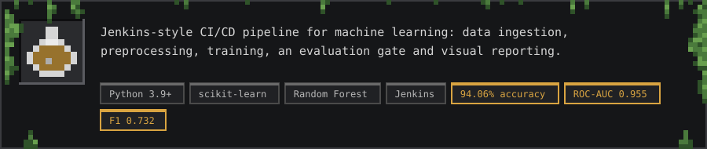
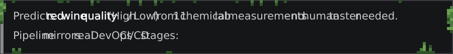
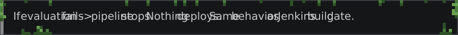
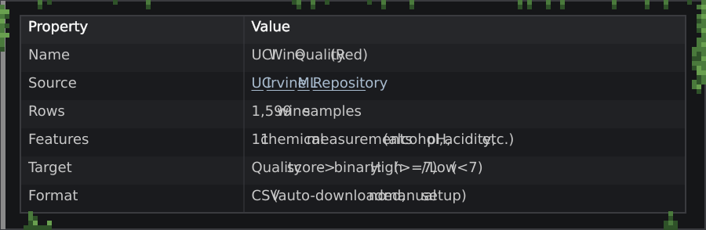
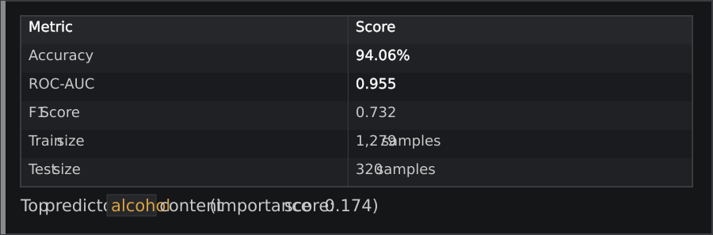
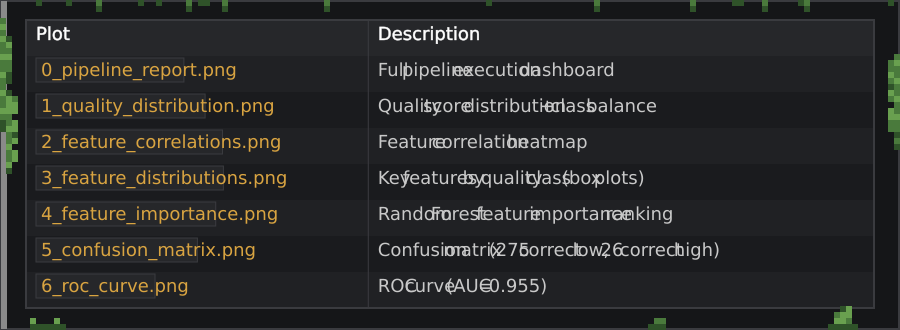
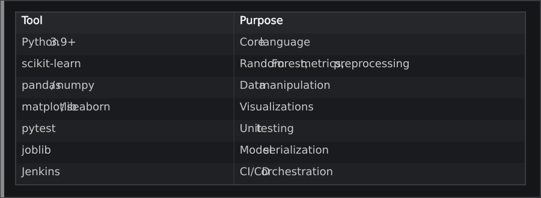

<p align="center"></p>

<p align="center"><sub>10-second tour: Ingest → Preprocess → Train → Gate → Visualize</sub></p>

<p align="center"></p>

<p align="center"></p>

<a id="what-it-does"></a>
<h2></h2>

<p align="center"></p>

```
Ingest → Preprocess → Train → Evaluate → Visualize
  ↓           ↓          ↓        ↓           ↓
Download    Clean &    Random   Gate: acc   6 visual
CSV from    split      Forest   must ≥ 75%  output
UCI Repo    data       100 trees  or FAIL   charts
```

<p align="center"></p>

<a id="dataset"></a>
<h2></h2>

<p align="center"></p>

<p align="center"><a href="https://archive.ics.uci.edu/ml/datasets/wine+quality"></a></p>

<a id="results"></a>
<h2></h2>

<p align="center"></p>

<a id="output-plots"></a>
<h3></h3>

<p align="center"></p>

<a id="quick-start"></a>
<h2></h2>

<a id="prerequisites"></a>
<h3></h3>

<p align="center"></p>

<a id="run-locally"></a>
<h3></h3>

```bash
# 1. Clone repo
git clone https://github.com/thanmaiashok/wine-quality-mlpipeline-DML-.git
cd wine-quality-mlpipeline-DML-

# 2. Create virtual environment
python3 -m venv venv
source venv/bin/activate        # Windows: venv\Scripts\activate

# 3. Install dependencies
pip install -r requirements.txt

# 4. Run full pipeline
chmod +x run_pipeline.sh
./run_pipeline.sh
```

<p align="center"></p>

```bash
cd pipeline
python stage1_ingest.py       # Download dataset
python stage2_preprocess.py   # Clean + split
python stage3_train.py        # Train model
python stage4_test.py         # Evaluate (fails if acc < 0.75)
python stage5_visualize.py    # Generate plots
python generate_report.py     # Generate report chart + markdown
```

<a id="run-tests"></a>
<h3></h3>

```bash
source venv/bin/activate
pytest tests/ -v
```

<a id="project-structure"></a>
<h2></h2>

```
wine-quality-mlpipeline-DML-/
├── Jenkinsfile                  # Jenkins pipeline definition
├── README.md
├── requirements.txt
├── run_pipeline.sh              # One-command local runner
│
├── pipeline/
│   ├── pipeline_runner.py       # Main entry point (runs all stages)
│   ├── stage1_ingest.py         # Stage 1: Download CSV from UCI
│   ├── stage2_preprocess.py     # Stage 2: Clean, scale, split
│   ├── stage3_train.py          # Stage 3: Train Random Forest
│   ├── stage4_test.py           # Stage 4: Evaluate + pipeline gate
│   ├── stage5_visualize.py      # Stage 5: Generate 6 plots
│   └── generate_report.py       # Generate summary dashboard
│
├── data/
│   ├── winedataset.md           # Dataset documentation
│   ├── raw/                     # Auto-downloaded CSV (git-ignored)
│   └── processed/               # Train/test splits (git-ignored)
│
├── models/                      # Saved model + metrics (git-ignored)
│
├── outputs/
│   ├── pipeline_report.md       # Execution report
│   └── plots/                   # 7 output PNG charts
│
└── tests/
    └── test_pipeline.py         # Unit tests (pytest)
```

<a id="jenkins-setup"></a>
<h2></h2>

<p align="center"></p>

<a id="tech-stack"></a>
<h2></h2>

<p align="center"></p>

<a id="license"></a>
<h2></h2>

<p align="center"></p>

<p align="center"><a href="https://github.com/thanmaiashok"></a></p>
